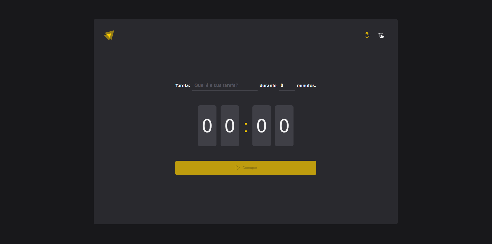
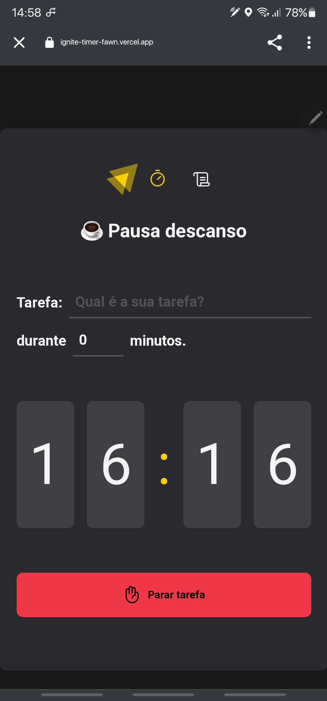
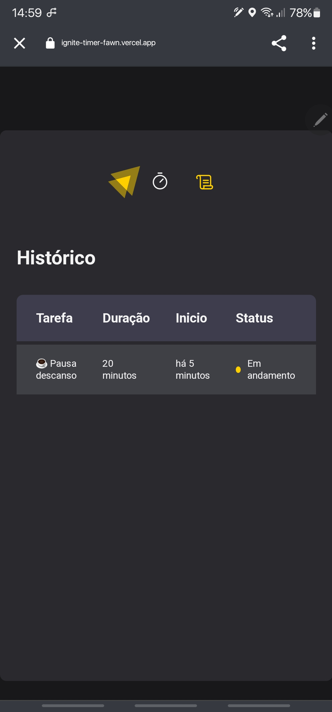

<div align="center">
    
    
             
</div>
    
<p align="center">   
    
</p>
<p align="center">
  <a href="#sobre">Sobre</a>&nbsp;&nbsp;&nbsp;|&nbsp;&nbsp;&nbsp;
  <a href="#tecnologias">Tecnologias</a>&nbsp;&nbsp;&nbsp;|&nbsp;&nbsp;&nbsp;
  <a href="#como-executar">Como Executar</a>&nbsp;&nbsp;&nbsp;|&nbsp;&nbsp;&nbsp; 
</p>

## Sobre

O projeto é uma aplicação desenvolvida com base nas técnicas de Pomodoro.

**Colabore com o projeto, comente, sugestões, reporte bugs, ajude a melhorar o projeto.❤️**

## Tecnologias

- [Typescript](https://www.typescriptlang.org/)
- [Vite](https://vitejs.dev/)
- [Styled-Components](https://styled-components.com/)
- [react-hook-form](https://react-hook-form.com/)

## Como Executar

- ### **Pré-requisitos**

  - É **necessário** possuir o **[Node.js](https://nodejs.org/en/)** instalado no computador
  - É **necessário** possuir o **[Git](https://git-scm.com/)** instalado e configurado no computador
  - Também, é **preciso** ter um gerenciador de pacotes seja o **[NPM](https://www.npmjs.com/)** ou **[Yarn](https://yarnpkg.com/)**.   

Executando a Aplicação:

```sh
  # Aplicação web
  $ cd Ignite-timer
  # Instalando as dependências do projeto.
  $ npm install
  # Inicie a aplicação web
  $ npm run dev
```

---
<sup>Projeto desenvolvido por [Aleksander Palamar](https://github.com/aleksanderpalamar), da [Portfólio](https://www.palamarsolutionit.com.br/).</sup>